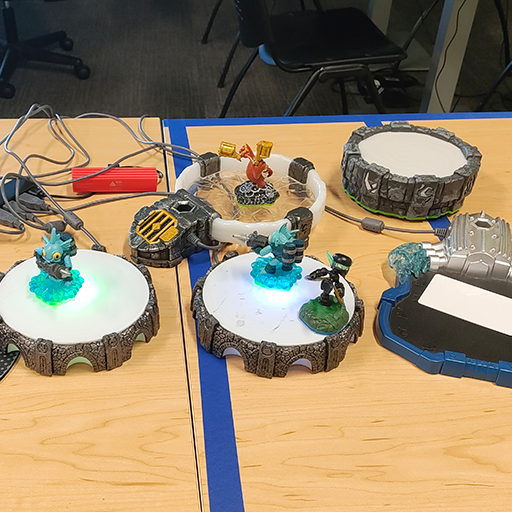
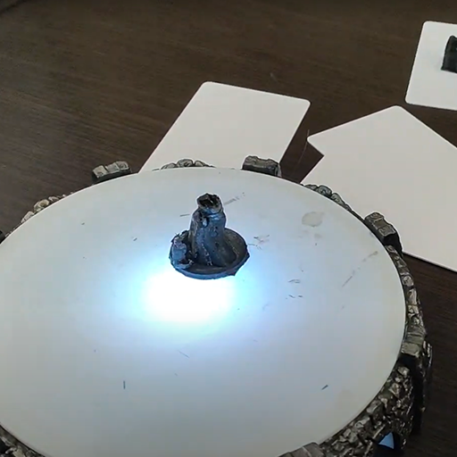
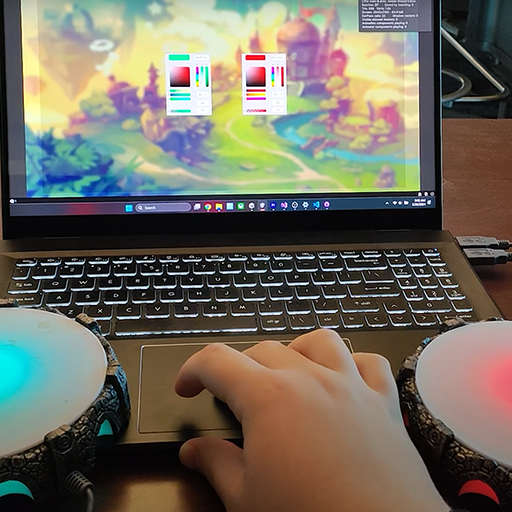

# 📻 Vortex Engine 🧸

**'NFC reader and writer in Unity using Skylanders portals'**

---

This is my Unity project dedicated to creating an easy way to use the Skylanders Portal of Power in any project.

Currently I am able to have
  - Multiple portals at the same time
  - Read and write commands at the same time
  - Create custom toys or use existing Skylanders

My program uses the Unity Input System to connect the portal as if it was a controller, then it can read and write to it as if you were using that way. By using the Player Input Manager and the Player Input components I was able to also tell the portals apart and create seperate UI elements to control them, which means that you could have each player have a portal in a game.

This project has many interesting aplications, but there is one problem. Every mainline console portal I own can be read and used with this system, but I cant find out why certain portals can be written to and other cant. Other scripts and projects that I have made and/or stole from others works with every portal including reading and writing.

If you have a soliution to this problem please yell at me, but for now I will work on other projects and come back in a few weeks to finish this project.

Watch how this system was made! - 
Watch my origional video breakdown here! - https://www.youtube.com/watch?v=XZ1t62T36xE&t=1045s

Cool people that got me started / good information
- https://github.com/mandar1jn
- https://github.com/silicontrip/SkyReader/blob/master/skylander.cpp
- https://support.activision.com/articles/skylanders-toy-faq
- https://www.darkspyro.net/skylanders/

Special Thanks to Marjin Kneppers (mandar1jn) for not killing me.

---

  
  
  

